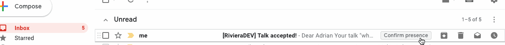

# Installation

## Pre-requisites

- node@10.16.0
- yarn

## Setup

### Configure Firebase

Create a firebase project with the [firebase console](https://console.firebase.google.com).

* Create a "Cloud Firestore" Database. It's okay to start in 'locked' mode. The rules will be overriden when you deploy.
* Activate "Google" as a sign-in provider for Authentication
* Activate "Storage" (used to store event images for banners)

Configure your Private Key :
* Go to project's settings
* Go to "Service accounts" tab, then go to "Firebase Admin SDK" section and click "Generate new private key"
* Copy the downloaded file into your project root and rename it "serviceAccount.json"

Create a `.env.local` file by copying `.env` file at root folder and set firebase environment variables. You can get all these variables from the homepage by clicking "Add an application" and selecting the web icon.

* `REACT_APP_API_KEY=<API_KEY>`
* `REACT_APP_AUTH_DOMAIN=<AUTH_DOMAIN>`
* `REACT_APP_PROJECT_ID=<PROJECT_ID>`
* `REACT_APP_STORAGE=<URL_STORAGE>`

### Configure Google APIs (optional)

Activate the following APIs in the [Google developer console](https://console.developers.google.com/apis) :

- Google Places API Web Service
- Google Maps Embed API
- Google Maps JavaScript API
- Google Geocoding API

### Configure Mailgun (optional)

The application sends emails through the [Mailgun API](https://www.mailgun.com/)

You have to create a Mailgun account if you want to send those emails, if not the app will still works perfectly but without sending any email.

Mailgun API is used to send email through Cloud Functions, so you will have to add environment variables with firebase CLI :

- The application URL: `app.url` (ex: `http://localhost:3000`)
- (optional) The Google Cloud Function URL: `app.gcf_url` (ex: `https://us-central1-conferencehall.cloudfunctions.net`).
  Used if you want to [Configure In-App google actions](#Configure_In-App_google_actions)
- The API key: `mailgun.key`
- The domain name: `mailgun.domain`

Here the command to register those variables:

```
firebase functions:config:set app.url="https://myserver.com" app.gcf_url="https://<CLOUD_REGION>-<YOUR_PROJECT_ID>.cloudfunctions.net" mailgun.key="MAILGUN API KEY" mailgun.domain="YOUR DOMAIN NAME"
```

To test cloud functions with Mailgun on local machine (with cloud function shell), you will need to generate `.runtimeconfig.json` file with environment variables :

```
firebase functions:config:get > .runtimeconfig.json
```

> **Important Note:** Mailgun is an external service from Firebase and Google, so to be able use it with you will need to activate Firebase pricing.

### Configure Mailgun webhook (optional)

To guarantee the acceptance or refusal emails are sent to speakers after deliberation is done, you can configure a
MailGun webhook.

- go to MailGun dashboard https://app.mailgun.com/app/webhooks
- log in to your MailGun account
- in webhooks list select `Delivered Messages` add your firebase cloud function `https://<CLOUD_REGION>-<YOUR_PROJECT_ID>.cloudfunctions.net/delivered`

For each delivered email, the proposal in DB will have a `emailDelivered` field to `true`.

### Configure In-App google actions (optional)

If you want to configure the email template to be able to display one-click action in gmail so that speakers can confirm their presence with one-click:


- send a request for your email's domain using [google form](https://docs.google.com/forms/d/e/1FAIpQLSfT5F1VJXtBjGw2mLxY2aX557ctPTsCrJpURiKJjYeVrugHBQ/viewform?pli=1)
- send a test email (as described in above doc) to `schema.whitelisting+sample@gmail.com`

NOTE: If you don't do the configuration the In-App confirmation will not be displayed but the speaker can still confirm his attendance within the content of the email.

### Configure Google Analytics (optional)

You can add a Google Analytics by adding your Analytics ID in the environmenent variable `REACT_APP_GOOGLE_ANALYTICS_ID` in the `.env.local` file.

## Run

### Run the app in dev mode

1. Clone the Conference Hall app and install dependencies:

```
git clone https://github.com/bpetetot/conference-hall.git
yarn
```

2. Configure the app with [Firebase](#configure-firebase) and [Google APIs](#configure-google-apis-optional)

3. Start the app:

```
yarn start
```

> Before using the app, you'll need to deploy the firestore security rules at least once (see below for how to deploy with firebase)

### Run unit test

```
yarn test
```

**Run tests with debug mode**

- Debug test: `yarn test:debug`
- Go to chrome: `chrome://inspect/#devices`
- Let go the debugger and put `debugger` in your test.

For more details on debugger within IDE, consult [react-script documentation](https://github.com/facebook/create-react-app/blob/ed5c48c81b2139b4414810e1efe917e04c96ee8d/packages/react-scripts/template/README.md#debugging-tests-in-chrome).

## Cloud functions

The project uses cloud functions for severals features (send emails, export, apis...). Before deploying the application, you need to resolve cloud functions dependencies.

All commands must be done in `/functions` folder with **node@8**

Cloud functions uses its own `package.json`, first install dependencies:

```
yarn
```

### Test APIs locally

```
yarn api
```

You can test it on `http://localhost:5000/api/v1/xxx?key=<API_KEY>`

An API key must be generated in Conference Hall app.

### Test triggered functions

```
yarn shell
```

See [cloud functions documentation](https://firebase.google.com/docs/functions/local-emulator) for more info.

### Run unit test

To run all cloud functions:

```
cd functions
yarn test
```

## Deploy

### Pre-requisites

1. Install [firebase-cli](https://firebase.google.com/docs/cli/) :

```
npm install firebase-tools -g
```

2. You must be logged with firebase and select project ([Firebase documentation](https://firebase.google.com/docs/web)) :

```
firebase login
firebase use --add
```

3. Install dependencies for the app and cloud functions.

### Build and deploy the app

```
yarn build
firebase deploy
```

## Frequent questions & issues

### Generate Beta Access keys

The application is still in beta mode for the organizer part, you will need to generate an access key in the database.

**To do it:**

- Go to the firebase console
- Select your project
- Go to the "Database" tab
- Create a collection named "betaAccess"
- Create an empty document with a generated ID
- This generated ID will be your access key

### Add a custom domain

If you want to use a custom domain, you will have to [configure Firebase accordingly](https://firebase.google.com/docs/hosting/custom-domain)

Then you will also need to configure Authentification providers to use your custom domain.

**To do it:**

- Change in your `.env.local` file, the `authDomain` property with your custom domain
- Follow instruction in chapter ["Customizing the redirect domain for Google sign-in"](https://firebase.google.com/docs/auth/web/google-signin)
